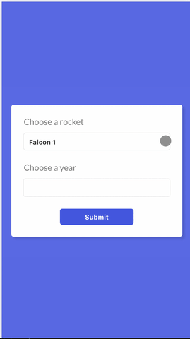

SpaceX-rockets is a web app that gives you the list of rockets from SpaceX and you can pick one of them to see how many times that rocket has been launched in a given year.

## Available Scripts

In the project directory, you can run:

### `npm start`

Runs the app in the development mode. 
Open [http://localhost:3000](http://localhost:3000) to view it in the browser.

As seen in the screenshot above, the app is fully responsive.

### `npm test`

This command is used for the unit testing part. The coverage can be seen in the below screenshot.
The "sad paths" are also tested.

### `npm test:e2e`

The command above will run the end-to-end tests using a real Chromium-based browser, which is controlled by Puppeteer. The test syntax used is Cucumber.
